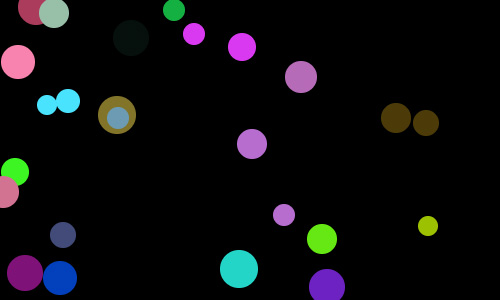

# Bouncing Balls

[](https://travis-ci.org/gerkirill/bouncing-balls)

<p align="center">
  <a href="https://gerkirill.github.io/bouncing-balls/" target="_blank">
    
  </a>
</p>

## Requirements
- make sure you have [nodejs](https://nodejs.org/) installed
- make sure you have [parcel](https://parceljs.org/) globally installed

## Run
```
npm install
npm start
```
Then open http://localhost:1234/ in your browser.

## Build
```
npm run build
```

## Test
```
npm test
```
## BE HAPPY!!!